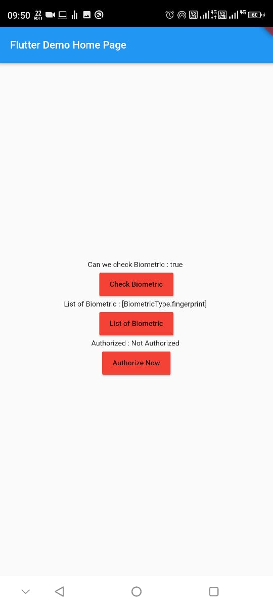
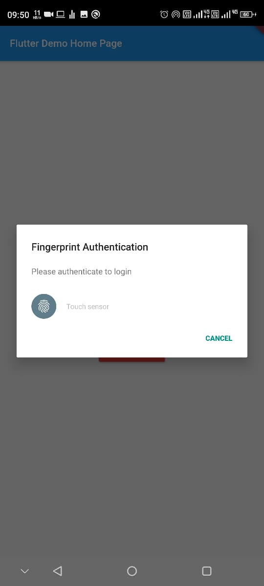
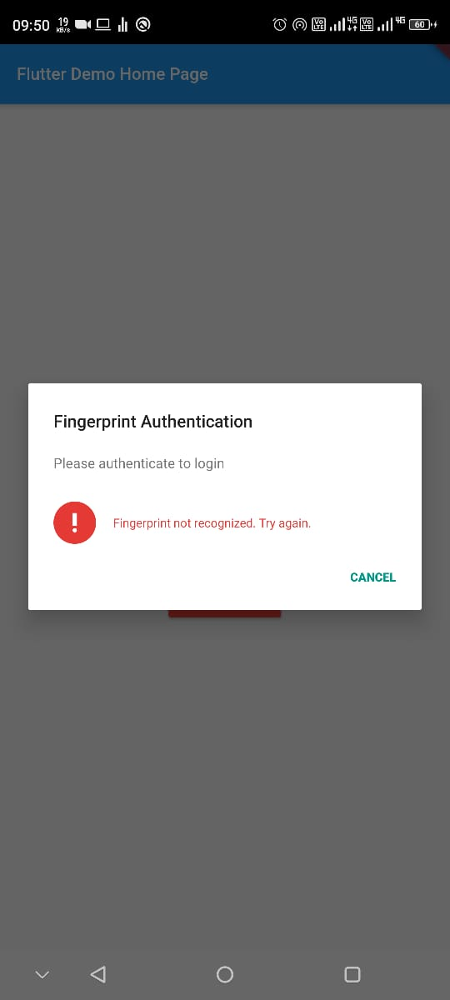
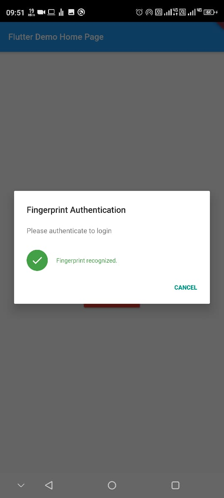

<h1 align="center">Welcome to Flutter Local-Auth App (Android) 👋</h1>
<p>
  
  <a href="to be added" target="_blank">
    
  </a>
  <a href="nonee" target="_blank">
    
  </a>
  </p>

  > Implementing Local Authentication in the Flutter App using 'local_auth' package. <br>
  It provides Fingerprint and FaceId authentication.

  ## APP PREVIEW


<p align="center">
  
  
  
  
 
</p>

  ## Install

```sh
flutter pub get
```

## Usage

```sh
flutter run
```

## Run tests

```sh
f5 / debug
```


## Author

👤 **Akshat Sachan**

* Website: sachan.netlify.com
* Twitter: [SachanAK36](https://twitter.com/sachanaks36)
* Github: [CryptocoderAS](https://github.com/CryptocoderAS)
* LinkedIn: [Akshat Sachan](https://www.linkedin.com/in/akshat-sachan-58b2921ab/)

## Show your support

Give a ⭐️ if this project helped you!

## 📝 License

Copyright © 2021 [Akshat Sachan](https://github.com/CryptocoderAS).<br />
This project is [Open Source](none) licensed.
